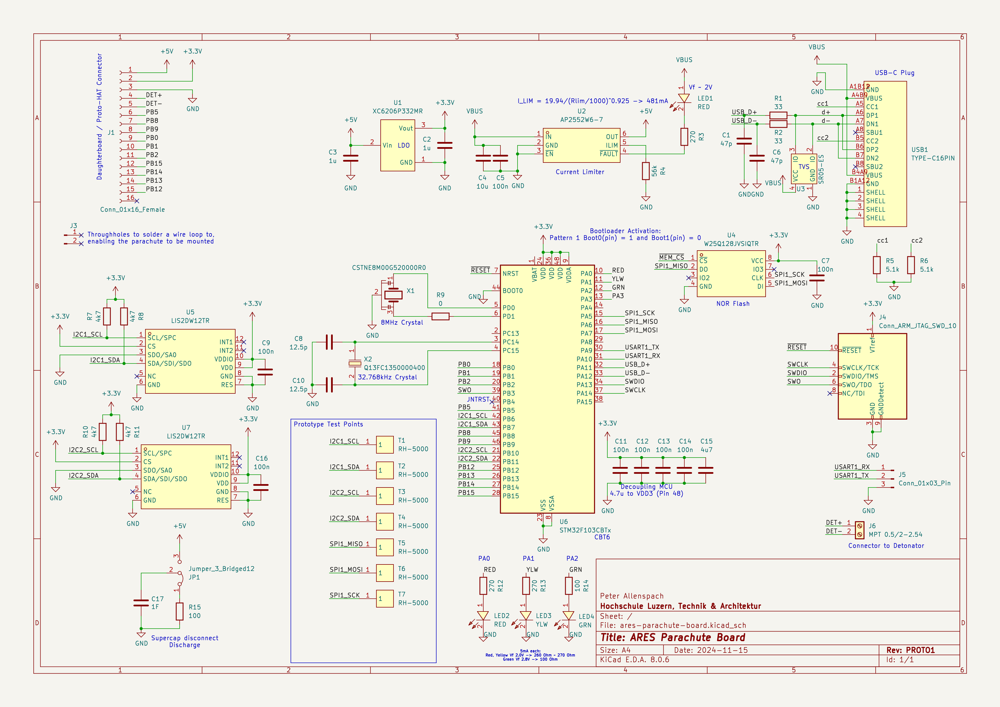

# ARES Parachute Board FW Repo

# TODO
- Wie fügt man source files hinzu?
- Wie konfiguriert man andere Debugprobes?
- Was macht das Demoprogramm?

## Projektstruktur
Das Projekt ist Standard, wie von STMCubeMX vorgesehen, aufgesetzt, mit CMake als build.

Libraries sind in `Drivers/STM32F1xx_HAL_Driver`

## Funktion Demoprogramm

`printf()` output ist momentan rerouted auf SWO/ITM.

Der main loop wartet immer am Ende für 10ms und inkrementiert count als primitives 'scheduling'. 

Falls mit `#define ENABLE_TEMP 1` aktiviert, wird ca. jede Sekunde der Temperatursensor des Accelerometer am ersten I2C-Bus ausgelesen und über `printf()` ausgegeben.

Falls mit `#define ENABLE_ACCEL_LED 1` aktiviert, wird der Zustand des Accelerometers jeden Loop ausgelesen, und falls die x, y bzw. z Register über einem bestimmten Wert sind, LED1, 2, bzw. 3 angeschaltet/ausgeschaltet.

### Note Debugging/SWO

Pin 1 für den Debugheader ist auf dem Board ein wenig unscheinbar markiert, er ist da, wo die Outline um den Header eine kleine 'Lücke' hat -> wenn Text auf Board in der Richtigen Orientierung ist, oben links.

Debug-Configs existieren für STLink (Untested), SEGGER J-Link (Alles funktioniert) und CMSIS-DAP/OpenOCD (Getestet mit MCU-Link von NXP, funktioniert alles bis auf SWO, SWO TODO).

Damit die Debugs laufen, müssen in `.vscode/launch.json` die Pfäde angepasst werden:

- Generell muss die STM32 Extension wissen, wo sich STM32CubeCL befindet, damit der Path dazu gelesen werden kann
- Für SEGGER muss `"serverpath"` auf den Path zu `JLinkGDBServerCL.exe` gesetzt werden. Diese .exe sollte sich im J-Link install directory befinden.
- CMSIS-DAP sollte 'einfach funktionieren', solange OpenOCD auf dem Computer installiert ist. Wenn `openocd` nicht im PATH ist, muss eventuell `"serverpath"` noch auf den Pfad zu `openocd.exe` gesetzt werden

Um zu debuggen (Build, Connect, Flash, Attach GDB, Halt Main) kann dann die normale Debug-Funktion von VSCode angewendet werden (Käfer mit Startsymbol in der Linken Leiste). Oben links kann die Debugkonfiguration ausgewählt werden. Wenn die richtige Debug-Konfiguration ausgewählt ist, kann man entweder über den Startknopf, oder einfach über `F5` Builden, Flashen, Attachen und debuggen.

## Pinbeschreibung

Momentan alle Pins auf Output, kann rekonfiguriert werden (Wie viele in? Wie viele out?) -> mit STMCubeMX.

## Wie setzt man IDE auf?

- VS Code installieren
- STM32 Extension installieren
- [STM32CubeCLT](https://www.st.com/en/development-tools/stm32cubeclt.html) installieren - wie von Extension gefordert
  - STM32CubeMX braucht man nicht umbedingt, ausser man will umbedingt Pinbelegungen mit GUI ändern.
- Für Debugging: Treiber installieren (TODO, SEGGER oder MCU-Link?)
  - SEGGER-Fall: JLink tools installieren, Path in launch.json auf JLink install setzen bei JLINK debug
  - MCU-Link: OpenOCD installieren, Path in launch.json auf OpenOCD Path setzen.

# ACHTUNG

Gewisse STM32CubeMX Versionen haben bugs, die z.B. das Linkerscript (STM32F103CBTx_FLASH.ld) kaputt machen, deswegen aufpassen, falls man doch STM32CubeMX verwenden will.

Version 6.13 scheint, zumindest auf Linux, kaputt beim Install zu sein, deswegen wurde 6.12.1 verwendet, die jedoch einen Bug in der Linkerfile generation hat. Wenn Code regeneriert wird, über git die changes an `STM32F103CBTx_FLASH.ld` discarden, oder von `STM32F103CBTx_FLASH.ld.backup` wiederherstellen.

**BITTE KEINE PROJEKTCHANGES MIT STM32CUBEMX 6.13 MACHEN, DA SONST LEUTE MIT LINUX DAS PROJEKTFILE NICHT MEHR ÖFFNEN KÖNNEN**